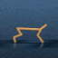
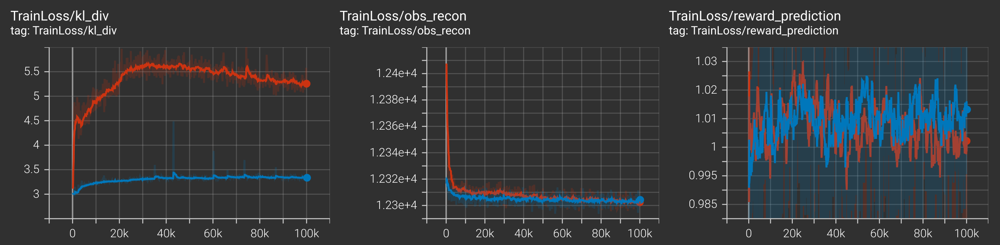

# PlaNet in PyTorch

|  |  |
|:---------------------------------------------------------------------------:|:---------------------------------------------------------------------------:|

This is my PyTorch implementation of the paper **Learning Latent Dynamics for Planning from 
Pixels** ([Hafner et al., 2018](https://arxiv.org/pdf/1811.04551)). 

However, since according to the authors, latent overshooting (LO) does not improve final performance significantly, 
it is not included in this implementation.

Note that, my interpretation of action repeat is that the agent has to perform the action at least twice for 
it to be considered as a repetition. Hence, setting `action_repeat` to 1 will cause the action to be performed twice in total.

# Usage
1. Install the dependencies listed in [requirements.txt](requirements.txt)
2. Run the following command to begin the training (default environment is dm-control's walker-walk) \
`python3 main_planet.py --configs defaults dmc`
3. To monitor the training progress use tensorboard \
`tensorboard --logdir=runs`

It is recommended to use [dm-control suite](https://github.com/deepmind/dm_control) for testing, 
as the reward from these environments are bounded from 0.0 to 1.0 across all domain and 
tasks [ref](https://arxiv.org/pdf/1801.00690.pdf). 
I included some wrappers for the gymnasium as well, but you'd have to apply appropriate reward boundaries.

# Performance Comparison

This model is trained according to the training schedule and reported hyperparameters mentioned in the original source paper. 
For example, cheetah-run is trained with action_repeat of 3 while walker-walk is trained with action_repeat of 1.
Test episodes are evaluated after each learning (model-fit + episode-collection) iteration.

I have trained this implementation (with single seed) on two of the following tasks from deep-mind control suits 

| Environment | Reported on   Paper | This Implementation   (without LO) |
|:-----------:|:----------------------:|:-------------------------------------:|
| Cheetah Run |          662           |                 ~630                  |
| Walker Walk |          994           |                 ~950                  |

Rewards obtained from test episodes during the training phases are as follows 
(blue for **cheetah-run**, red for **walker-walk**)

And these are the training losses

I could not run the original source code ([link](https://github.com/google-research/planet)) which was written in TF1. 
While trying to build the environment for that, I was getting some error (regarding labmaze and bazel) 
and was unable to fix that issue. 
If someone is able to run the original source code, please let me know how to. I would really appreciate that.

# Contact
Shoot me a message (mazharul2752@gmail.com) if you have any questions and queries regarding this implementation.